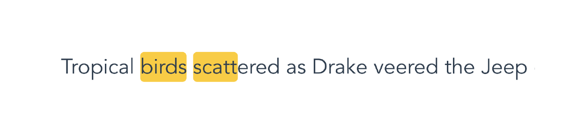

<p align="center"><a href="https://albertlucianto.github.io/vue-text-highlight" target="_blank" rel="noopener noreferrer"></a></p>

<p align="center">
<a href="https://codecov.io/github/AlbertLucianto/vue-text-highlight?branch=master"></a>
<a href="https://travis-ci.org/AlbertLucianto/vue-text-highlight"></a>
<a href="https://npmcharts.com/compare/vue-text-highlight?minimal=true"></a>
<a href="https://npmcharts.com/compare/vue-text-highlight?minimal=true"></a>
<a href="https://www.npmjs.com/package/vue-text-highlight"></a>
<a href="https://www.npmjs.com/package/vue-text-highlight"></a>
</p>

## See working example [here](https://albertlucianto.github.io/vue-text-highlight).

## Installation

```bash
npm install --save vue-text-highlight
# or
yarn add vue-text-highlight
```

## Usage

### Basic Usage

```javascript
import Vue from 'vue';
import TextHighlight from 'vue-text-highlight';

Vue.component('text-highlight', TextHighlight);

// new Vue ...
```

#### SomeComponent.vue

```html
<template>
  <text-highlight :queries="queries">{{ description }}</text-highlight>
</template>
```

```javascript
data() {
  return {
    queries: ['birds', 'scatt'],
    description: 'Tropical birds scattered as Drake veered the Jeep'
  };
}
```

#### Output

<p align="center"></p>

### More Options

All available props in `TextHighlight` component are:

* __`queries:`__ `Array<String|RegExp>|String|RegExp`

  This prop accepts string, regex, and array of strings or regex. If array is given, it will highlight the union of matched strings/regex globally.

* __`[caseSensitive]:`__ `Boolean`

  Whether string being searched is case sensitive.
  
* __`[diacriticsSensitive]:`__ `Boolean`
  
  Whether string being searched is diacritics sensitive.

* __`[highlightStyle]:`__ `Object|Array|String`

  Styles to be applied to highlighted `<mark>`. Similar to style bindings in vue, it accepts `Array` syntax, `Object` syntax, or plain styling as `String`. This prop will then be merged with default highlight styles in `TextHighlight` component. [See style binding in Vue.js.](https://vuejs.org/v2/guide/class-and-style#Binding-Inline-Styles)

* __`[highlightClass]:`__ `Object|Array|String`

  Classes to be added to highlighted `<mark>`. Similar to class bindings in vue, it accepts `Array` syntax, `Object` syntax, or class as `String`. [See class binding in Vue.js.](https://vuejs.org/v2/guide/class-and-style#Binding-HTML-Classes)

* __`[highlightComponent]:`__ `Object|String`

  By default vue-text-highlight uses `<mark>` for the highlighting. Pass this props to override with other tag (`string`) or custom component (Vue component definition).

  This component will be passed with two props from `text-highlight`:

  * __`index:`__ `Number`

    Index of highlighted component.

  * __`text:`__ `String`

    Highlighted words, equals to `this.$slots.default[0].text`
  
  For more details, see [example below](#advanced-usage).

* Other props and listeners that are not listed above are forwarded to the highlighted component. These props will be merged with higher precendence than `index` and `text` passed from `text-highlight`.

### Advanced Usage

There might be a case where you want to do more things with the highlighted words. For that reason, vue-text-highlight supports custom component for the highlighted words. In this case, the following example alerts on click.

#### OtherComponent.vue

```html
<template>
  <text-highlight
    :queries="queries"
    :highlightComponent="MyClickableComponent"
    :baz="foo"
    @customlistener="alert"
  >
    {{ description }}
  </text-highlight>
</template>
```

```js
import MyClickableComponent from 'MyClickableComponent';
```

```js
data() {
  return {
    queries: ['birds', 'scatt'],
    description: 'Tropical birds scattered as Drake veered the Jeep'
    MyClickableComponent,
    foo: 'bar',
  };
},
methods: {
  alert() {},
}
```

#### MyClickableComponent.vue

```html
<template>
  <mark class="custom" @click="$emit('customlistener')">
    <slot></slot>
  </mark>
</template>
```

```js
props: {
  baz: String, // From OtherComponent.vue
  index: Number, // From TextHighlight
  text: String, // From TextHighlight, equals to `this.$slots.default[0].text`
}
```

## Changelog

Changes are tracked in the [changelog](CHANGELOG.md).

## License

vue-text-highlight is available under the MIT License.
