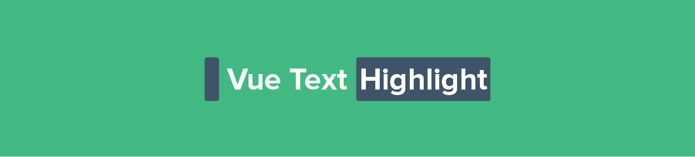

<p align="center"><a href="https://albertlucianto.github.io/vue-text-highlight" target="_blank" rel="noopener noreferrer"></a></p>

<p align="center">
<a href="https://codecov.io/github/AlbertLucianto/vue-text-highlight?branch=master"></a>
<a href="https://travis-ci.org/AlbertLucianto/vue-text-highlight"></a>
<a href="https://npmcharts.com/compare/vue-text-highlight?minimal=true"></a>
<a href="https://npmcharts.com/compare/vue-text-highlight?minimal=true"></a>
<a href="https://www.npmjs.com/package/vue-text-highlight"></a>
<a href="https://www.npmjs.com/package/vue-text-highlight"></a>
</p>

## Installation

```bash
npm install --save vue-text-highlight
# or
yarn add vue-text-highlight
```

## Usage

### Basic Usage

```javascript
import Vue from 'vue';
import TextHighlight from 'vue-text-highlight';

Vue.component('text-highlight', TextHighlight);

// new Vue ...
```

#### SomeComponent.vue

```html
<template>
  <text-highlight :queries="queries">{{ description }}</text-highlight>
</template>
```

```javascript
data() {
  queries: ['birds', 'scatt'],
  description: 'Tropical birds scattered as Drake veered the Jeep'
}
```

#### Output

<p align="center"></p>

### More Options

All available props in `TextHighlight` component are:

* `queries: Array<String>|String`

  This prop accepts string or array of strings. If array of strings is given, it will highlight the union of matched strings.

* `caseSensitive: Boolean`

  Whether string being searched is case sensitive.

* `highlightStyle: Object|Array|String`

  Styles to be applied to highlighted `<span>`. Similar to style bindings in vue, it accepts `Array` syntax, `Object` syntax, or plain styling as `String`. This prop will then be merged with default highlight styles in `TextHighlight` component. [See style binding in Vue.js.](https://vuejs.org/v2/guide/class-and-style#Binding-Inline-Styles)

* `highlightClass: Object|Array|String`

  Classes to be added to highlighted `<span>`. Similar to class bindings in vue, it accepts `Array` syntax, `Object` syntax, or class as `String`. [See class binding in Vue.js.](https://vuejs.org/v2/guide/class-and-style#Binding-HTML-Classes)

## Changelog

Changes are tracked in the [changelog](CHANGELOG.md).

## License

vue-text-highlight is available under the MIT License.